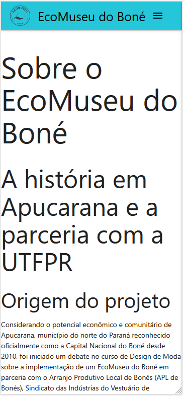
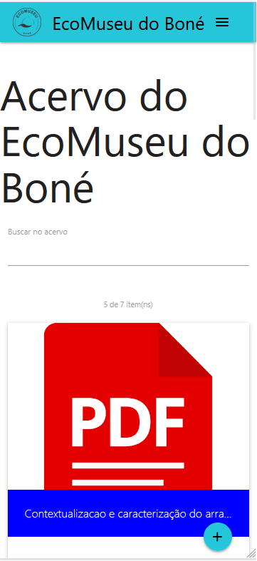
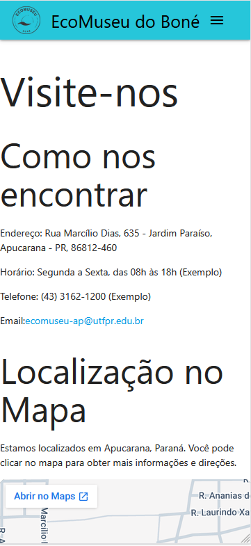
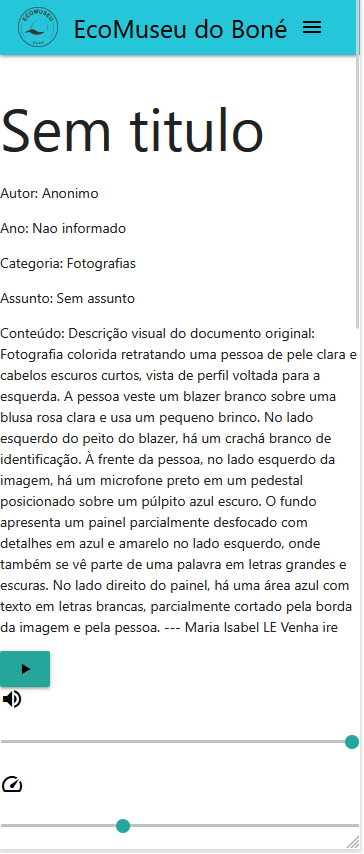
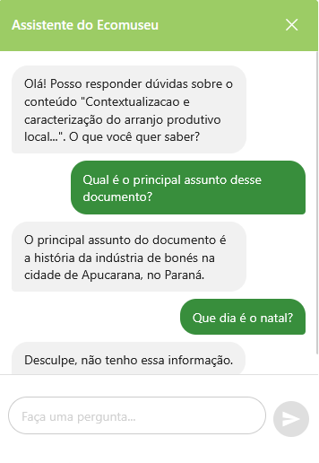

# Site Mobile Assistivo Para Pessoas com Deficiência Visual Total

Este projeto consiste em um site web assistivo desenvolvido para o EcoMuseu do Boné de Apucarana-PR, projetado nativamente para pessoas com deficiência visual total (cegueira). O objetivo principal do sistema é garantir autonomia e navegação fluida em dispositivos móveis por meio de Tecnologias Assistivas.

O desenvolvimento aplicou conceitos de Engenharia de Software e Interação Humano-Computador (IHC), focando em uma Árvore de Acessibilidade (AOM - *Accessibility Object Model*) enxuta, HTML semântico e forte uso da especificação WAI-ARIA. 

Além disso, o projeto conta com um Assistente Virtual (Chatbot com RAG), que permite a exploração do acervo do museu via comandos de voz, garantindo uma interface conversacional e inclusiva.

---

## Ferramentas 

### Frontend & Acessibilidade
- **Frameworks:** Angular e Materializer CSS 
- **Marcação e Semântica:** HTML5 + WAI-ARIA (Atributos como `aria-live`, `aria-hidden`, `aria-expanded`)
- **Padrões de Acessibilidade:** Diretrizes WCAG 2.2 (Nível AA) e Norma Brasileira ABNT NBR 17225:2025
- **Testes de Qualidade:** WAVE (Web Accessibility Evaluation Tool), NVDA, TalkBack (Android) e VoiceOver (iOS)

### Back-end & Inteligência Artificial
- **Inteligência Artificial:** Cohere API
- **Arquitetura de Dados:** RAG (*Retrieval-Augmented Generation*)
- **Gerenciamento de Conteúdo:** Sveltia CMS (Git-based JSON database)
- **Comparativo Tecnológico:** No escopo do projeto, foi gerada uma ramificação secundária do projeto construída no **Oracle APEX** (plataforma Low-Code) para fins de comparação científica de verbosidade na Árvore de Acessibilidade (AOM).

---

## Funcionalidades
- **Acessibilidade:** Código construído com foco 100% no leitor de tela, estruturado com HTML5 Semântico (`<main>`, `<nav>`) e controle preciso de foco (TabIndex).
- **Integração Multimodal:**
  - Chatbot alimentado pela API da Cohere utilizando **RAG** (*Retrieval-Augmented Generation*) para responder perguntas exclusivas sobre o acervo do museu.
  - Interação via voz para comandos e respostas.
- **Dupla Abordagem de Áudio:** Implementação de audiodescrições de arquivos históricos com leitura nativa (Web Speech API) e *fallback* de segurança com áudios pré-gravados em `.wav`.
- **Mobile-First & Touch Targets:** Áreas de clique (botões e links) desenhadas obedecendo rigorosamente os critérios de acessibilidade da WCAG 2.2.
- **Gestão Desacoplada (Headless CMS):** Arquitetura escalável utilizando o Sveltia CMS baseado em Git, armazenando o acervo em arquivos JSON.
---

## Requisitos

Antes de começar, certifique-se de ter instalado em sua máquina:

- [Node.js](https://nodejs.org/) (versão 18+)
- [Angular CLI](https://angular.io/cli)
- Chave de API da Cohere (para o Chatbot funcionar)

Para verificar se estão instalados, execute:

```bash
node --version
npm --version
```

---

## Instalação

1. **Clone e acesse o diretório do projeto:**

```bash
git clone https://github.com/IF-DeividSilva/Page_EcoMuseu.git
```
```bash
cd Page_EcoMuseu
```

2. **Instale as dependências:**

```bash
npm install
```

---

## Como Usar

### Iniciar o Servidor de Desenvolvimento

```bash
ng serve
```

O aplicativo abrirá automaticamente em [http://localhost:4200](http://localhost:4200). A página será recarregada quando você fizer alterações nos arquivos.


## Representação da Estrutura Hierárquica de Armazenamento da Base de Dados

```
Base de dados Ecomuseu/
├── Dados/
│   ├── Artigos/
│   │   ├── artigo_2.pdf
│   │   └── ...
│   └── Audios/
│       ├── audio_2.wav
│       └── ...
└── Metadados/
    ├── metadados_principal.json
    ├── metadados_conteudos/
    │   ├── metadados_conteudo_2.json
    │   └── ...
    └── metadados_WCAG.json
        
```

## Estrutura do projeto

```
PAGE_ECOMUSEU/
├── src/
│   ├── app/
│   │   ├── components/
│   │   │   ├── accessibility-component/
│   │   │   ├── button-component
│   │   │   ├── chatbot-component
│   │   │   ├── control-component
│   │   │   ├── footer-component
│   │   │   ├── image-component
│   │   │   ├── navbar-component
│   │   │   ├── reading-order-component
│   │   │   └──video-component
│   │   ├── pages/
│   │   │   ├── acervo-page/
│   │   │   ├── detalhes-page/
│   │   │   ├── sobre-page/
│   │   │   └── visite_nos-page/
│   │   └── services/
│   │       ├── accessibility-service.ts
│   │       ├── acervo-service.ts
│   │       ├── chatbot-service.ts
│   │       └── spreech-service.ts
│   └── assets/
│       ├── imagens_do_site
│       └── ...
├── index.html
├── main.ts
├── styles.css
├── angular.json
├── package-lock.json
├── package.json
├── README.md
├── tsconfig.app.json
├── tsconfig.json
└── tsconfig.spec.json
        
```


# Fotos do Site
---
## Home e Acervo

--------


---
## Visite-nos e Detalhes

--------



---
## Chatbot



## Componentes

### **AccessibilityComponent**
Componente orquestrador central da lógica de acessibilidade. Recebe o conteúdo de um item do acervo, consulta os critérios WCAG associados e injeta dinamicamente os sub-componentes adequados no elemento-alvo da página.
 
**Inputs:**
- `idConteudo` — ID do item de conteúdo do acervo
- `elementoAlvo` — Elemento HTML onde os sub-componentes serão injetados
- `conteudo` — Objeto com os dados do item (metadados, arquivo, texto, etc.)
**Lógica de injeção por critério WCAG:**
 
| Critério(s) | Componente injetado | Condição |
|---|---|---|
| 5, 6, 7, 8 | `ButtonComponent` (áudio `.wav`) | `conteudo.tem_audio === true` |
| 5, 6, 7, 8 | `ButtonComponent` (Speech API) | `conteudo.tem_audio === true` |
| 2 | `ControlComponent` | Sempre que houver botão de áudio ou vídeo |
| 1 + 2 | `VideoComponent` + `ButtonComponent` + `ControlComponent` | Arquivo com extensão `.mp4`, `.webm` ou `.ogg` |
| 14, 22 | `ReadingOrderComponent` | Critérios de ordem de leitura e foco previsível |
| 18 | `ImageComponent` | Arquivo com extensão de imagem (`.jpg`, `.png`, etc.) |
 
---
 
### **ButtonComponent**
Componente de botão acessível para reprodução de mídia. Suporta três modos de operação: reprodução de áudio pré-gravado (`.wav`), controle de elemento de vídeo externo e leitura sintetizada via Web Speech API.
 
**Critérios WCAG atendidos:** 5 (semântica com `<button>` nativo), 6 (`aria-label` dinâmico descrevendo a ação atual), 7 (área mínima de toque de 44×44px via CSS).
 
**Inputs:**
- `itemId` — ID do item do acervo, usado para montar a URL do arquivo `.wav`
- `mediaEl` — Elemento `HTMLMediaElement` externo (usado no modo vídeo)
- `tipo` — Modo de operação: `'audio'` | `'video'` | `'speech'` (padrão: `'audio'`)
- `texto` — Texto a ser lido no modo `speech`
**Estado:**
```typescript
reproduzindo: boolean  // Controla o ícone exibido (play/pause) e o aria-label
```
 
**Comportamento:**
- **Modo `audio`:** Cria um `HTMLAudioElement` interno sob demanda e alterna play/pause.
- **Modo `video`:** Delega play/pause ao `mediaEl` externo recebido via `@Input()`.
- **Modo `speech`:** Usa a `SpeechSynthesis API` com `lang: 'pt-BR'`. Suporta pausa/retomada da leitura em andamento.
---
 
### **ControlComponent**
Componente de controles de acessibilidade para mídia. Exibe sliders para ajuste de volume e velocidade de reprodução, compatível com áudio, vídeo e síntese de voz.
 
**Critério WCAG atendido:** 2 (controle de áudio — o usuário pode pausar, parar ou ajustar o volume de qualquer mídia que inicie automaticamente).
 
**Inputs:**
- `mediaEl` — Elemento `HTMLMediaElement` externo (áudio ou vídeo)
- `tipo` — Tipo de mídia controlada: `'audio'` | `'video'` | `'speech'` (padrão: `'audio'`)
- `texto` — Texto em reprodução (necessário para reiniciar a Speech API com novos parâmetros)
**Estado:**
```typescript
volume:     number  // Valor atual do volume (0 a 1, padrão: 1)
velocidade: number  // Valor atual da velocidade (0.5 a 2, padrão: 1)
```
 
**Comportamento:**
- **Modo `audio` / `video`:** Atualiza diretamente `mediaEl.volume` e `mediaEl.playbackRate`.
- **Modo `speech`:** Persiste os valores no `SpeechService` e reinicia a `SpeechSynthesis` para aplicar o novo volume ou velocidade (a API só aceita esses parâmetros no início da fala).
---
 
### **ChatbotComponent**
Componente de assistente virtual conversacional. Abre como um modal com gerenciamento de foco completo (inert nos elementos ao redor), suporta entrada por texto e por voz, e utiliza `LiveAnnouncer` do Angular CDK para garantir que todas as interações sejam anunciadas aos leitores de tela.
 
**Critérios WCAG atendidos:** `aria-live="polite"` no histórico de mensagens, `role="dialog"` com `aria-modal="true"`, captura e liberação de foco com `cdkTrapFocus`, e uso de `inert` para isolar o restante da página durante a interação.
 
**Inputs:**
- `idConteudo` — ID do conteúdo do acervo associado ao chatbot
- `titulo` — Título do item exibido na mensagem inicial do assistente
**Estado:**
```typescript
mensagens:   Mensagem[]  // Histórico de mensagens { role: 'user' | 'assistant', text: string }
userInput:   string      // Texto digitado pelo usuário
isRecording: boolean     // Indica se o microfone está ativo
speechOk:    boolean     // Indica se a Web Speech API é suportada pelo navegador
loading:     boolean     // Indica que uma resposta está sendo aguardada da API
isOpen:      boolean     // Controla a visibilidade do modal
erroMic:     string      // Mensagem de erro do microfone (exibida e anunciada)
erro:        string      // Mensagem de erro da API (exibida e anunciada)
```
 
**Métodos públicos:**
- `open()` — Abre o modal e aplica `inert` nos elementos externos para isolar o foco
- `close()` — Fecha o modal e remove todos os atributos `inert`
- `send()` — Envia a pergunta à API (via `ChatbotService`) e anuncia a resposta
- `toggleMic()` — Inicia a captura de voz via `SpeechRecognition`; o envio ocorre automaticamente ao detectar silêncio

### **FooterComponent**
Componente de rodapé do site. Exibe os logos do EcoMuseu do Boné e do APL Bonés de Apucarana, além de links externos para as redes sociais do museu.

**Critérios WCAG atendidos:** `aria-label` no `<footer>`, uso de `<section>` com `aria-label` para agrupar os links externos, e `aria-label` nos links indicando que abrem em nova aba.

> Não possui `@Input()` — é um componente puramente estático e de apresentação.

---

### **ImageComponent**
Componente de exibição de imagens do acervo. Renderiza a imagem do item com texto alternativo preenchido dinamicamente a partir do banco de dados, garantindo descrição semântica real para leitores de tela.

**Critério WCAG atendido:** 18 (texto alternativo para imagens de conteúdo — o atributo `alt` é populado com o campo `conteudo` do metadado, que contém a descrição real da imagem, nunca um valor genérico).

**Inputs:**
- `conteudo` — Objeto com os metadados do item do acervo (campos `conteudo`, `categoria`, `arquivo`)

**Computed properties:**
```typescript
get imagemUrl(): string  // Monta a URL da imagem: acervoRaw + categoria + arquivo
```

---

### **NavbarComponent**
Componente de navegação principal. Gerencia o menu desktop e o menu lateral móvel (sidenav do Materialize), com controle completo de foco e acessibilidade: `aria-expanded` no botão hambúrguer, `aria-hidden` e `tabindex` nos links do sidenav conforme o estado de abertura, e uso de `inert` para isolar o restante da página quando o menu mobile está aberto.

**Critérios WCAG atendidos:** `aria-current="page"` no link ativo, gerenciamento de foco ao navegar entre rotas (foco movido automaticamente para o conteúdo da nova página), captura de foco no sidenav via `inert` em `<main>`, `<footer>` e `<nav>`.

> Não possui `@Input()` — injeta `Router` diretamente via `inject()`.

**Comportamento:**
- **Menu mobile:** O sidenav inicializa via `M.Sidenav.init()` aguardando a disponibilidade do Materialize (polling com `setInterval`). Ao abrir, aplica `inert` no restante da página e move o foco para o primeiro link; ao fechar, remove `inert` e restaura `aria-expanded`.
- **Navegação por rota:** A cada `NavigationEnd`, fecha o sidenav (se aberto) e move o foco para o elemento `<main>` ou para o primeiro elemento após o `<router-outlet>`, garantindo que o leitor de tela anuncie o novo conteúdo.

---

### **ReadingOrderComponent**
Componente de metadados do item do acervo. Renderiza em ordem de leitura semanticamente correta os campos descritivos do conteúdo (autor, ano, categoria, assunto e conteúdo), garantindo sequência previsível de leitura para leitores de tela.

**Critérios WCAG atendidos:** 14 (ordem de leitura significativa — os campos são renderizados em sequência lógica e predefinida, independente do objeto recebido) e 22 (foco previsível — os elementos são renderizados como parágrafos semânticos dentro de uma `<section>` com `aria-label`).

**Inputs:**
- `conteudo` — Objeto com os metadados do item do acervo

**Campos exibidos (em ordem fixa):**

| Campo | Chave no objeto |
|---|---|
| Autor | `autor` |
| Ano | `ano` |
| Categoria | `categoria` |
| Assunto | `assunto` |
| Conteúdo | `conteudo` |

Campos ausentes ou nulos no objeto são omitidos silenciosamente via `*ngIf`.

---

### **VideoComponent**
Componente de exibição de vídeos do acervo. Renderiza um `<video>` nativo com descrição acessível vinculada via `aria-describedby`, permitindo que o leitor de tela anuncie o conteúdo descritivo do vídeo antes da reprodução. O controle de play/pause e volume é delegado ao `ButtonComponent` e ao `ControlComponent`, injetados externamente pelo `AccessibilityComponent`.

**Critério WCAG atendido:** 1 (alternativa em texto para conteúdo de vídeo — a descrição do vídeo é exposta via `aria-describedby` apontando para um parágrafo com classe `.sr-only`, visível apenas para leitores de tela).

**Inputs:**
- `conteudo` — Objeto com os metadados do item do acervo (campos `titulo`, `conteudo`, `categoria`, `arquivo`, `id_conteudo_pk`)

**Computed properties:**
```typescript
get videoUrl(): string   // Monta a URL do vídeo: acervoRaw + categoria + arquivo
get descId():   string   // Gera ID único para o aria-describedby: 'desc-video-{id}'
```

**Estado:**
```typescript
reproduzindo: boolean  // Atualizado pelos eventos nativos (play), (pause) e (ended) do elemento <video>
```

---

## Notas de Desenvolvimento

- O projeto utiliza **`eval()`** para cálculos matemáticos, o que é adequado para fins educacionais, mas não é recomendado para aplicações em produção. Para versões futuras, considere usar uma biblioteca como `math.js`.
- Os componentes utilizam **CSS Modules** para evitar conflitos de estilos globais.
- O estado é gerenciado com **React Hooks** (em componentes funcionais) e **Class Components** (em componentes de classe).

---

## Próximas Melhorias Sugeridas

- Ampliação da amostra de testes com mais usuários reais;
- Inclusão de participantes com diferentes graus de deficiência visual;
- Implementação de personalização de interface:
  - controle de contraste;
  - ajuste de tamanho da fonte;
- Inclusão de feedbacks sonoros no sistema;
- Desenvolvimento de leitor de tela embutido no site;
- Suporte a usuários não adaptados aos recursos nativos de acessibilidade dos dispositivos móveis.


---

## Licença

Este projeto é software livre, desenvolvido como um produto para validar e mostrar a viabilidade da metodologia do meu TCC. O conteúdo do EcoMuseu do Boné pertence aos seus respectivos mantenedores.


---

## Autor
Deivid da Silva Galvão - UTFPR (Universidade Tecnológica Federal do Paraná)

---

